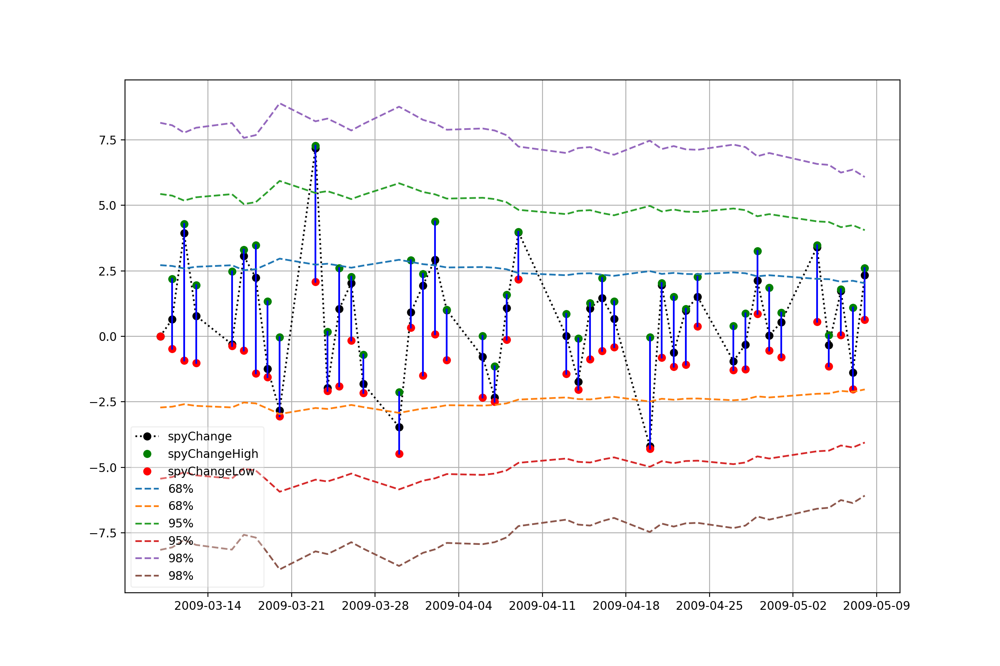

## Vix vs. Spy moves

## back test on historic data:
From  2008-09-01  to  2009-05-10

Using  2.0  times of standard deviation. \
positive 10.0 . Total:  173 \
('positive rate: ', 71.42857142857143, '%.')

Using  3.0  times of standard deviation. \
positive 3.0 . Total:  173 \
('positive rate: ', 100.0, '%.')